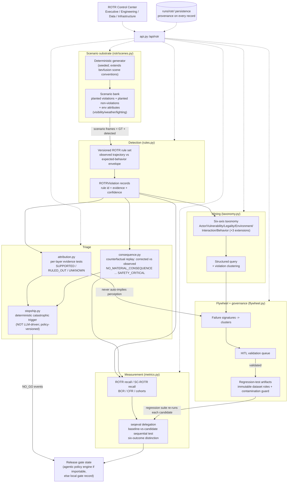

# ROTR — Right-of-the-Road Violation Detection, Triage, Evaluation & Training

Status: accepted (implementation in `sensorflow/rotr/`, API `/api/rotr`,
UI "ROTR Control Center"). Companion docs: `nextgen-adr.md` (reuse
precedents), `nextgen-architecture-comparison.md` (three-path format this
doc extends).

Evidence discipline used throughout: every claim is tagged
**[Observed]** (verified in this repo by import/read/execution),
**[Documented]** (stated in repo docs but not independently executed here),
**[Proposed]** (what `sensorflow/rotr` adds), or **[Inference]**
(engineering judgment about systems outside this repo — phrased as "a
production system could…", never as a claim about any specific vendor's
implementation).

---

## 1. Executive architecture — three paths, one problem

The problem: detect events where an AV (or a labeled agent in a log)
violated right-of-the-road rules — failure to yield, restricted-path entry,
wrong lane association, intersection conflicts, unsafe merges — then triage
them by causal layer, measure whether they *matter behaviorally*, and feed
the confirmed ones back into evaluation and training **without ever
auto-attributing a violation to perception**. Causal-layer separation is
the load-bearing design constraint: a ROTR violation is a statement about
*behavior versus expectation*, and behavior is downstream of at least eight
candidate causes (perception, prediction, planning, localization, map,
control, the policy rule itself, and the data/label that recorded it). Any
architecture that hard-wires "violation ⇒ perception bug" produces false
blame at scale, poisons the training flywheel with mislabeled failure
cohorts, and — worst — hides genuine planning regressions behind perception
noise.

### Path A — 2-day rapid PoC

One notebook/script: hand-rolled rule checks over a handful of logs or
synthetic scenes, printed violation counts, maybe a CSV. **[Inference]**
Its fundamental property is that *detection and judgment are fused*: the
same code that finds "ego didn't stop" also decides it was a perception
miss, because there is no evidence model that could distinguish causes. No
provenance, no versioned rules, no negative controls (scenes that *look*
like violations but aren't), no statistics — a count of 12 violations
cannot be compared to last week's 9 because neither number has a
denominator, a seed, or a rule version attached. Path A answers "can we see
these events at all?" and nothing else. It is the correct first spend of
two days and the wrong foundation for a third day.

### Architecture B — Sensorflow Studio gated evaluation (THIS codebase)

What this repo already is, grounded in what I verified:

* **Deterministic synthetic substrate** — `sensorflow.bevfusion.scenes.generate_sequences`
  produces seeded scene sequences with GT boxes, occlusion, day/night/rain
  cycling **[Observed]**; `sensorflow.raremine` generates seeded scene banks
  for mining **[Observed]**.
* **Surrogate-safety math** — `sensorflow.safety.ssam_ext` implements
  `projected_ttc`, `zone_grid_pet`, `drac`, `rect_gap`, `rects_overlap`,
  `collision_probability` **[Observed]**; `sensorflow.retro.metrics.stopping_distance`
  gives friction/latency-parameterized stopping distance **[Observed]**.
* **Closed-loop behavioral evaluation** — `sensorflow.nextgen.closedloop.run_closed_loop`
  is a deterministic IDM-longitudinal planner + first-order actuation over
  `ActorTrack`s with a seeded perception failure model and a `corrected=True`
  ground-truth-injection mode; `nextgen.causal.causal_replay` diffs
  actual-vs-corrected and issues `BEHAVIORALLY_CONSEQUENTIAL` / `METRIC_ONLY`
  verdicts **[Observed]**.
* **Sequential statistics** — `sensorflow.seqeval.evaluate_regression`
  (paired sequential testing over megaeval populations, early stopping,
  stratum attribution, INSUFFICIENT as a first-class outcome) **[Observed]**.
* **Distribution-shift forensics** — `megaeval.analysis.distribution_shift`
  and the `rca` package's planted-cause forensics stages **[Observed]**.
* **Governed data lineage** — `raremine.lineage` refuses
  `TRAINING_CANDIDATE` for members of protected evaluation sets without a
  recorded governance override (`LeakageError`) **[Observed]**;
  `agentic.flywheel` mirrors these semantics for its regression suites
  **[Observed]**.
* **Deterministic release policy** — `agentic.policy.evaluate` is a
  versioned, hash-addressed policy engine with pre-authorized
  `AUTOMATIC_STOP_SHIP` conditions and a fail-safe INDETERMINATE outcome
  **[Observed]**.

The fundamental difference from Path A is **separation of concerns
enforced by contracts**: detection (rules over evidence), attribution
(per-layer evidence tests), consequence (counterfactual behavioral replay),
statistics (delegated sequential testing), and governance (lineage +
policy gates) are separate modules with typed interfaces, each
independently testable, each with provenance. A violation here is a
*record with evidence*, not a print statement. What Architecture B does
NOT claim: its scenes are synthetic and its planner is simplified — it
measures the *machinery* of ROTR evaluation, and every threshold derived
from synthetic data is labeled ILLUSTRATIVE **[Proposed — carried through
the implementation]**.

### Conceptual Production-L4 architecture

**[Inference throughout this subsection.]** A production system could keep
Architecture B's *shape* — the module boundaries are the durable asset —
while swapping every substrate behind a vendor-replaceable interface:

* Scenario substrate → fleet logs + a log-ingestion contract (the
  `ROTRScenario` contract in §7 is deliberately log-shaped: frames of ego
  pose + actor states + map context, all versioned).
* Rule engine → a formalized traffic-rule library (jurisdiction-aware,
  legally reviewed), still deterministic and versioned; the rule-id +
  evidence-fields output contract is unchanged.
* Perception diff → real GT from labeling pipelines or auto-label
  consensus, behind the same "GT-vs-detected" evidence interface.
* Counterfactual replay → the actual planner stack in resimulation, or a
  learned world model behind an adapter boundary
  (`nextgen.worldmodel.ExternalWorldModelAdapter` already documents that
  contract shape: determinism, provenance labels, no gate exemption
  **[Observed]**).
* Statistics → the same sequential-testing discipline, but the population
  is fleet miles and the strata are ODD cells; exposure weights calibrated
  from actual fleet exposure rather than a synthetic bank (§6).
* Governance → the same lineage/contamination guards, backed by a real
  dataset registry and an incident-review workflow with human sign-off.

What changes is *evidence strength and scale*, not architecture: each
Architecture B module names the production component that replaces it, and
the interfaces are the deliverable that survives the swap.

---

## 2. Unified data/control-flow diagram

Control flow: everything is request-scoped FastAPI over file persistence
(the platform convention **[Observed]** across all 12 landed packages); no
daemons, no queues. Determinism: same seed + rule version + policy version
⇒ byte-identical violation set.

---

## 3. ROTR event model

A ROTR violation is **a function of five structured evidence inputs**, and
is undefined if any is missing (missing ⇒ `UNKNOWN`, never a default):

| Evidence input | Contents | Why it is load-bearing |
|---|---|---|
| `EgoState` (sequence) | pose (x, y, yaw), speed, acceleration, lane association, localization confidence | "Ego entered the intersection at 9.8 m/s" is meaningless without knowing *which lane the ego believed it was in* — wrong-lane-association violations live entirely in the gap between true and believed lane. |
| `RoadContext` | lane geometry, intersection topology (controlled/uncontrolled), traffic-control devices (signal state, stop/yield signs), crosswalks, permitted maneuvers per lane, speed limits | The *same trajectory* is legal at a green light and a violation at a red one. Expected behavior is derived from context, so context errors (map layer) are a first-class attribution target. |
| `ActorStates` (sequences) | per-actor pose/velocity/class, right-of-way state (HAS_ROW / MUST_YIELD / NONE), intent (CROSSING / MERGING / YIELDING / PROCEEDING), occlusion, GT-vs-detected pairing | Right-of-way is *relational*: ego's obligation exists only relative to a specific actor's state and intent. The GT-vs-detected pairing is what lets attribution test the perception layer instead of assuming it. |
| `ObservedBehavior` | the trajectory the ego actually drove (+ the plan it computed, when available) | The plan/trajectory split is what separates planning failures (bad plan, faithful execution) from control failures (good plan, unfaithful execution). |
| `ExpectedBehavior` | the envelope of acceptable behavior: legal path corridor, permissible maneuver set, yield/stop obligations with trigger conditions, speed envelope | An *envelope*, not a single reference trajectory — many trajectories are acceptable; a violation is exit from the envelope, which is why superficially-aggressive-but-legal maneuvers (assertive merge with sufficient gap) are planted as NON-violations in the scenario bank. |

`violation = f(EgoState, RoadContext, ActorStates, ObservedBehavior,
ExpectedBehavior)` — the rule engine consumes all five and records *which
fields of which inputs* drove the decision (the `evidence` block of every
`ROTRViolation`), so attribution and HITL review can re-derive the verdict
from the record alone.

---

## 4. Three-level maturity model

**Level 1 — PoC (detect).** Rules over one data source; violations as
console output; no attribution, no statistics, no governance. Exit
criterion: the rule set finds planted violations and *rejects planted
non-violations* on a fixed bank. Risk accepted: numbers are not
comparable across runs.

**Level 2 — Gated evaluation (this implementation).** Everything in §2:
versioned rules, per-layer attribution with UNKNOWN as a legal state,
counterfactual consequence classification, sequential baseline-vs-candidate
statistics with the six-outcome distinction, taxonomy mining, HITL-governed
flywheel with contamination guards, deterministic stop-ship. Exit
criterion: a model candidate can be *blocked* by a ROTR regression with an
auditable evidence trail, and no training set can silently absorb a
regression-suite member. Risk accepted: synthetic substrate — verdicts
demonstrate machinery, not road reality; all thresholds ILLUSTRATIVE.

**Level 3 — Closed-loop production.** **[Inference]** Fleet logs in,
jurisdiction-aware rule library, resimulation with the real planner,
exposure weights calibrated from fleet miles, incident-review integration,
and the flywheel driving actual retraining with measured
regression-suite pass-rate improvement per cycle. Exit criterion: a
confirmed on-road ROTR event class shows measurable recurrence reduction
across two consecutive releases without any regression-suite contamination
event. The architecture is unchanged from Level 2; each module's substrate
is swapped behind its existing interface (§1, Production-L4).

---

## 5. Failure attribution model

Principle: **downstream failure never auto-implies an upstream cause.**
Each causal layer gets an independent evidence *test*; each test returns
`SUPPORTED`, `RULED_OUT`, or `UNKNOWN` (evidence unavailable). A layer is
implicated only by its own positive evidence — never by another layer's
absence of evidence. The canonical trap this prevents: a planted
planning-error case with *perfect perception* must attribute to planning,
with perception `RULED_OUT` (GT-vs-detected diff is empty), and the test
suite enforces exactly that.

| Layer | Evidence test (what SUPPORTED requires) | Evidence source in this repo |
|---|---|---|
| Perception | GT-vs-detected diff shows a missed/misplaced/misclassified actor *material to the rule that fired* (the actor the ego failed to yield to, not any actor) | GT/detected pairing planted in `scenes.py`; diff logic in `attribution.py` **[Proposed]**; pattern precedent: `nextgen.closedloop.PerceptionModel` corrected mode **[Observed]** |
| Prediction | Actor's ground-truth intent (e.g. CROSSING) diverges from the intent the stack predicted, while detection itself was adequate | planted `predicted_intent` vs `intent` per actor **[Proposed]** |
| Planning | Perception + prediction adequate at decision time, yet the computed plan exits the expected-behavior envelope | plan-vs-envelope check; planted planning-fault cases **[Proposed]** |
| Localization | Ego believed pose/lane differs from true pose/lane beyond threshold | planted ego pose-error cases; `localization_error_m` field **[Proposed]** |
| Map | `RoadContext` as mapped differs from as-built (signal present but unmapped, wrong permitted-maneuver set) | planted map-mismatch cases (`map_context` vs `actual_context`) **[Proposed]** |
| Control | Planned trajectory acceptable; executed trajectory deviates beyond actuation tolerance | planned-vs-executed diff **[Proposed]**; actuation-lag precedent in `nextgen.closedloop` **[Observed]** |
| Policy/rule | The rule itself misfires: evidence fields are internally consistent and behavior was within a *reasonable* envelope — flagged for HITL rule review, not silently suppressed | planted non-violation cases that superficially match rule patterns **[Proposed]** |
| Data/label | Provenance checks fail: frame gaps, timestamp disorder, GT self-inconsistency | record-integrity checks; precedent: `rca` OFFLINE_CONTAMINATION / LABEL_LATENCY planted causes **[Observed]** |

The **attribution matrix** is one row per violation × eight layer columns,
each cell carrying `{status, evidence, confidence}`. Multiple layers can
be SUPPORTED simultaneously (a missed detection *and* a late plan);
`primary_layer` is the highest-confidence SUPPORTED layer, and is `None`
(triage to HITL) when nothing is SUPPORTED — that is the honest outcome,
not a bug.

---

## 6. Metric hierarchy

Detection-layer metrics (precision/recall of boxes) are necessary but
categorically insufficient for ROTR: they average over exposure, weight a
parked-car miss equal to a crossing-pedestrian miss, and say nothing about
behavior. The ROTR hierarchy, bottom-up:

1. **ROTR recall** = detected planted violations / all planted violations
   (per rule, per cohort). Suits ROTR because the scenario bank gives a
   true denominator — on fleet data this becomes recall against
   HITL-adjudicated events. The companion **ROTR precision** is measured
   by the planted non-violations (false-accusation rate), which generic
   detection metrics have no analogue for.
2. **Safety-critical ROTR recall (SC-ROTR)** = exposure-weighted recall
   restricted to violations whose consequence class is SAFETY_CRITICAL or
   whose scenario involves a vulnerable actor. **Weight calibration**: the
   weight of stratum *s* is `w_s = p_harm(s) / p_harm(reference)` where
   `p_harm` is estimated from the *consequence replay outcomes on the bank
   itself* (fraction of stratum members whose counterfactual divergence
   crosses the safety envelope) — i.e. weights are *derived from measured
   exposure-to-harm in the same evaluation substrate*, not hand-picked
   class multipliers. On synthetic data these weights are ILLUSTRATIVE by
   construction and labeled as such; the calibration *procedure* (weights
   from measured harm exposure, monotone in severity, renormalized per
   release) is the deliverable, and a production system could feed it
   fleet-measured harm rates without changing the code path.
3. **Behavioral Consequence Rate (BCR)** = fraction of detected violations
   whose consequence class ≥ DEGRADED_COMFORT. Separates "the rule fired"
   from "the vehicle's behavior actually changed the outcome" — this is
   the ROTR analogue of `nextgen.causal`'s METRIC_ONLY vs
   BEHAVIORALLY_CONSEQUENTIAL verdict **[Observed precedent]**.
4. **Critical Failure Rate (CFR)** = SAFETY_CRITICAL consequences per
   scenario evaluated (a rate with a denominator, reportable with a
   Wilson interval — precedent `rca.stats.wilson_ci` **[Observed]**).
5. **Regression verdicts** — baseline vs candidate deltas on 1–4 are
   *claims*, and claims go through `seqeval.evaluate_regression`
   **[Observed]** with rare-event handling (cluster-aware effective n).
   Every comparison is forced into the **six-outcome distinction**:
   observed difference / statistically significant / practically
   significant / safety-critical / insufficient evidence /
   distribution-driven (the last diagnosed with `megaeval` shift analysis
   + `rca` comparison-validity concepts **[Observed]**). A raw delta is
   never reported as a conclusion.

**Surrogate-safety caveat** (carried into code comments and the UI):
TTC, PET, DRAC and friends are *conflict proxies*. Low TTC does not alone
establish collision risk (it ignores controllability, evasive options,
and actor reaction), and high TTC does not establish safety (occlusion,
surface, kinematic limits). They gate *triage priority* here, never a
GO/NO-GO by themselves; the stop-ship trigger requires a conjunction of
independent evidence (§ stopship), not a surrogate threshold.

---

## 7. Data contracts design

All contracts are pydantic models in `rotr/models.py`; all persist as JSON
under `runs/rotr/` (platform convention **[Observed]**). Every record
carries a `Provenance` block: `scenario_id`, `dataset_version`,
`model_version`, `software_version` (rotr component versions),
`calibration_version` (weight/threshold set), `timestamp`, `source`
(SYNTHETIC / LOG / COUNTERFACTUAL), `confidence`. Contracts:

`ROTRScenario` (frames of `EgoState` + `ActorState` + `RoadContext`,
planted-truth block for evaluation) · `ROTRViolation` (rule id/version,
evidence fields, actor refs, confidence) · `FailureAttribution` (matrix
row: eight `LayerEvidence` cells + primary layer) · `CounterfactualScenario`
(corrected-input replay spec + divergence measurements) ·
`PlannerEvaluation` (observed vs corrected trajectory + per-metric deltas) ·
`SafetyAssessment` (TTC/PET/clearance/stopping/braking/lateral + the
surrogate caveat inline) · `RegressionResult` (six-outcome verdict +
seqeval delegation payload) · `HITLReview` (queue item, action, actor,
timestamp) · `TrainingCandidate` (dataset role, guard state, lineage) ·
`ReleaseGateResult` (stop-ship policy version, conjunction evidence,
GO/NO_GO). Design rules: IDs are content-addressed where possible
(policy hashes mirror `agentic.policy.policy_hash` **[Observed]**);
enums over booleans for tri-state evidence; no field defaults that could
fabricate evidence (`UNKNOWN` is explicit).

---

## 8. Build / Reuse / Integrate / Do-Not-Build

Format per row: decision — business value / complexity / ops burden /
failure modes / 3am cost / replacement strategy.

| Capability | Decision | Rationale |
|---|---|---|
| Statistical regression testing | **REUSE** `seqeval.evaluate_regression` + megaeval populations | Value: gate-grade sequential stats with zero new statistical code (the highest-risk code class to hand-roll). Complexity: adapter only (map ROTR cohort deltas → stratum effects). Ops: none beyond seqeval's own. Failure mode: population meta missing → create-on-demand, seeded. 3am cost: near zero — deterministic, file-backed. Replacement: swap the adapter to feed fleet strata; seqeval interface unchanged. |
| Surrogate-safety math | **REUSE** `safety.ssam_ext` (`projected_ttc`, `zone_grid_pet`, `rect_gap`, `rects_overlap`) + `retro.metrics.stopping_distance` | Value: reviewed geometry code shared with 3 packages; consistent numbers across the platform. Complexity: direct calls. Failure modes: shape mismatches (states dicts) — caught by tests. 3am: zero. Replacement: production replaces the *inputs* (real trajectories), not the math. |
| Scene conventions | **REUSE** `bevfusion.scenes` conventions (DT, seeding discipline, GTBox shape) — **BUILD** the road-context generator | bevfusion scenes are straight-road, no intersections/signals/right-of-way **[Observed]**, so ROTR *must* build topology + ROW states; but it keeps DT=0.1, seeded `default_rng`, ego-frame conventions so downstream consumers (studio_ux BEV replay) stay compatible. Failure mode of building: geometry bugs → planted-truth tests. 3am: generator is pure/deterministic. Replacement: log-ingestion adapter emits the same `ROTRScenario`. |
| Counterfactual replay | **REUSE** `nextgen.closedloop` planner (importable today) with a self-contained IDM fallback reusing `ssam_ext` math (nextgen is an in-progress workstream — guarded import, graceful fallback, re-checked at integration end) | Value: consequence classification is the highest-value triage signal. Complexity: medium (trajectory diffing). Failure modes: nextgen API drift → fallback planner keeps the feature alive; verdicts labeled with which engine produced them. 3am: deterministic, no services. Replacement: production resim behind the same `replay(scenario, corrected) → trajectory` seam. |
| Mining / dedup / diversity | **REUSE raremine patterns conceptually** (signature → dedup → diversity → destination), own implementation | raremine's store/models are bound to its own `TrackCandidate` bank **[Observed]**; forcing ROTR violations into that store couples two lifecycles. We mirror the *semantics* (incl. `LeakageError` guard behavior) over ROTR-native records. Failure mode: semantic drift from raremine — contract tests pin the guard behavior. Replacement: a production system could back both with one dataset registry. |
| Contamination guard | **BUILD** local, mirroring `raremine.lineage` semantics; **INTEGRATE** `studio2` registry when it lands (not importable today **[Observed]**) | Guard is 60 lines; correctness is testable; blocking on an unlanded package is worse. Re-check at end of build: if `sensorflow.studio2` becomes importable, wire through its registry. |
| Release gate | **INTEGRATE** `agentic.policy` (importable today, guarded) — stop-ship conjunction evaluated locally, forwarded as advisory `PolicyInput` | Value: one deterministic policy authority platform-wide. Failure mode: agentic in-flight changes → local gate record is always written; agentic outcome attached when available. 3am: both paths file-backed. |
| World models | **INTEGRATE behind nextgen's boundary** (`ExternalWorldModelAdapter` contract **[Observed]**) | ROTR never talks to a world model directly; if/when one lands behind nextgen's adapter, counterfactual generation upgrades transparently. |
| Vector DB / embedding search for clusters | **DO-NOT-BUILD** | Violation clustering here is over *structured* taxonomy signatures (exact + Jaccard similarity) — an index over ~10³ records needs a dict, not a service. A vector DB adds an ops dependency, an embedding-versioning problem, and a 3am pager (index corruption, service down) for zero verdict change at this scale. Replacement trigger: when signatures become unstructured (free-text descriptions, image embeddings) AND the corpus exceeds what exact structured search handles — then buy, don't build. |
| Custom stats / dashboards / metric store | **DO-NOT-BUILD** | seqeval/megaeval/rca cover the statistics; JSON under `runs/rotr/` matches every landed package; the UI reads the API like every other Studio page. |
| LLM triage of stop-ship | **DO-NOT-BUILD** (explicitly) | The catastrophic trigger must be a deterministic, versioned conjunction — auditable, reproducible, and immune to prompt drift. LLM assistance belongs in HITL *summarization*, never in the gate. |

---

## 9. Roadmap — Phases 0–7

Phases marked ✅ are ALREADY effectively complete in this codebase (landed
packages provide them); ROTR work is phases 2–6.

| Phase | Scope | Depends on | Components / interfaces | Tests / acceptance | Failure modes | Measurable outcome |
|---|---|---|---|---|---|---|
| **0 — Substrate** ✅ | Deterministic scenes, sensors, GT, persistence conventions | — | `bevfusion.scenes/sensors`, `runs/` convention | landed suites green | — | seeded scene banks reproducible byte-for-byte |
| **1 — Safety math + stats foundations** ✅ | Surrogate measures, sequential testing, shift forensics | 0 | `safety.ssam_ext`, `seqeval`, `megaeval`, `rca` | landed suites green | — | reusable, tested math with zero ROTR-specific code |
| **2 — ROTR detection PoC** | Road-context scenarios + versioned rule engine | 0,1 | `rotr/scenes.py`, `rotr/rules.py`; `generate_bank(seed) → ROTRScenario[]`, `evaluate(scenario) → ROTRViolation[]` | planted violations found AND planted non-violations rejected; determinism test | over/under-fit rules → negative-control cases in the bank | 100% planted-truth agreement on the seeded bank |
| **3 — Attribution** | Per-layer evidence tests + matrix | 2 | `rotr/attribution.py`; `attribute(violation, scenario) → FailureAttribution` | planning-error-with-perfect-perception → planning (perception RULED_OUT); map/localization planted cases correct | evidence gaps mislabeled → UNKNOWN is enforced default | 0 auto-perception attributions across the bank |
| **4 — Consequence** | Counterfactual replay + classification | 2,3 | `rotr/consequence.py`; `replay(scenario, violation) → PlannerEvaluation + SafetyAssessment` | cosmetic → NO_MATERIAL_CONSEQUENCE; missed crossing ped → SAFETY_CRITICAL | fallback-vs-nextgen divergence → engine recorded on every verdict | BCR/CFR computable on the full bank |
| **5 — Metrics + regression gate** | Metric hierarchy, seqeval delegation, six outcomes, stop-ship | 2–4 | `rotr/metrics.py`, `rotr/stopship.py` | weight monotonicity; six-outcome mapping; stop-ship fires ONLY on the defined conjunction | weight miscalibration → calibration doc + monotonicity test | candidate blockable by ROTR regression with audit trail |
| **6 — Mining + flywheel** | Taxonomy, structured query, clusters, HITL, roles + guard | 2–5 | `rotr/taxonomy.py`, `rotr/flywheel.py` | spec query returns exactly matching violations; guard raises without override | signature drift splits clusters → signature version pinned | confirmed violation → regression artifact in one governed path |
| **7 — Production hardening** | Fleet logs, jurisdictional rules, real resim, calibrated weights | 2–6 + external | log adapter emitting `ROTRScenario`; rule library; registry integration | shadow-mode parity vs HITL adjudication | **[Inference]** log quality, rule jurisdiction gaps, resim fidelity | recurrence reduction of confirmed classes across releases |

---

## 10. Capability comparison — what changes architecturally

| Capability | Path A (2-day PoC) | Architecture B (this codebase) | Production-L4 [Inference] |
|---|---|---|---|
| Scenario source | a few hand-built cases | seeded generator, planted truth incl. negative controls | fleet logs + targeted resim; *change:* ingestion contract replaces generator behind the same `ROTRScenario` |
| Rule evaluation | inline ifs, unversioned | versioned deterministic rule set, evidence-field output | jurisdiction-aware legal rule library; *change:* rule content, not the engine contract |
| Attribution | none (violation ⇒ "model bug") | 8-layer evidence matrix, UNKNOWN legal, no auto-perception | same matrix over real stack telemetry; *change:* evidence sources, not the matrix |
| Consequence | none | counterfactual IDM replay, 4-class verdicts | full-stack resim / world model behind adapter; *change:* replay engine behind the same seam |
| Statistics | raw counts | sequential testing, six-outcome, rare-event aware | same discipline, fleet-mile denominators; *change:* population + exposure calibration |
| Safety weighting | none | exposure-derived, ILLUSTRATIVE-labeled, monotone | calibrated from fleet harm rates; *change:* calibration inputs only |
| Data governance | none | immutable roles + contamination guard + override audit | registry-backed with org-level enforcement; *change:* backing store |
| Release decision | vibes | deterministic stop-ship conjunction + policy engine, NO_GO auditable | same, plus human safety board integration; *change:* authority chain, not the trigger |
| Mining | grep | six-axis taxonomy + structured query + clustering | same axes over embeddings + structured; *change:* retrieval substrate when scale demands |
| UI | notebook plots | four-audience control center on live API | same views on fleet-scale aggregates; *change:* aggregation layer |

The through-line: Path A → B adds *contracts, evidence discipline, and
governance*; B → L4 swaps *substrates behind those contracts*. Nothing in
B's module graph is thrown away on the way to L4 — which is the definition
of "no unnecessary infrastructure debt" this design optimizes for.
