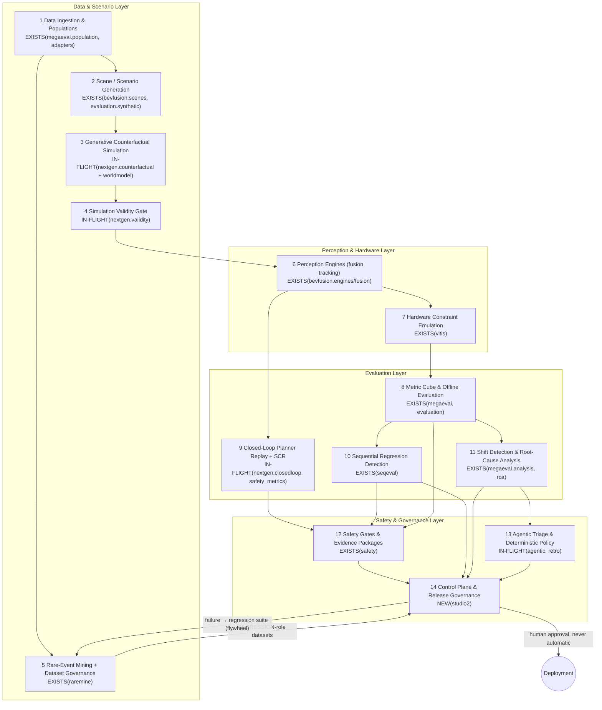
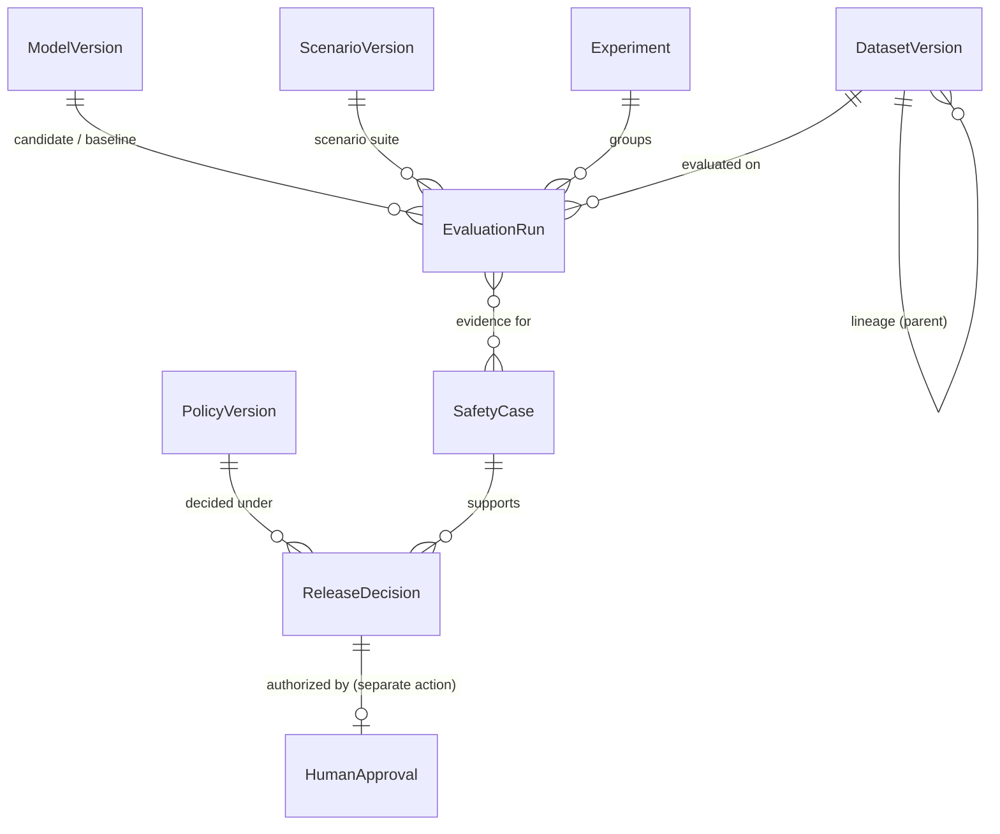

# Sensorflow Studio 2.0 — Architecture Review

**Closed-Loop Evaluation, Generative Simulation & Agentic Safety Governance**

Status: review of the actual codebase as of 2026-08-12. Every claim below is grounded in a
real file or endpoint in this repository. Annotations: **EXISTS(pkg)** = landed and importable,
**IN-FLIGHT(pkg)** = being built by concurrent agents (importable today but treated as unstable),
**NEW(studio2)** = added by this work in `sensorflow/studio2/`.

> Landed mid-review: `sensorflow.hardening` (production contracts, readiness, power math)
> became importable while this work was in progress; studio2's hardware matrix delegates its
> minimum-evidence sizing to `hardening.power.required_n_two_proportions` (with a Wilson
> fallback kept for environments where hardening is absent). `agentic`, `nextgen` and `retro`
> also import cleanly today and are wired into the release gate as guarded optional inputs.

---

## A. Critique of Studio 1.x

### A.1 Where 1.x came from

Studio 1.x grew out of an **open-loop label-evaluation tool**: `app_backend.py` (a single
FastAPI monolith) plus `sensorflow/evaluation/` — a pipeline that generates synthetic frames
(`evaluation/synthetic.py`), auto-labels them, grades annotations against ground truth
(`evaluation/graders.py`), triages disagreements into a human-review queue
(`evaluation/triage.py`, `evaluation/records.py: ReviewTask/HumanReview`) and tracks metric
deltas between model versions (`evaluation/regression.py`). Around it accreted accident-data
scripts (`accident_*.py`), a taxonomy layer, and a large React dashboard (`src/`).

### A.2 The exact limitations, and their current status

| # | Limitation of Studio 1.x | Status today | Fixed by |
|---|---|---|---|
| 1 | **Open-loop only**: perception scored frame-by-frame against labels; a detection error that a planner would absorb counts the same as one that causes a collision | FIXED | IN-FLIGHT(nextgen): `nextgen/closedloop.py: run_closed_loop, plan_acceleration` replays scenarios through a reactive planner; `nextgen/safety_metrics.py: safety_report` computes SCR / risk-weighted recall / TTC |
| 2 | **No generative simulation**: evaluation data was fixed synthetic sequences; no counterfactual "what if the pedestrian crossed 0.5 s earlier" | FIXED | IN-FLIGHT(nextgen): `nextgen/counterfactual.py` (11-op transformation catalogue), guarded by `nextgen/validity.py` (physical/temporal/sensor/identity/distribution checks) behind a `WorldModelProvider`-style boundary (`nextgen/worldmodel.py: SceneTransformer, ExternalWorldModelAdapter`) |
| 3 | **Fixed-n evaluation, p-value peeking**: `evaluation/regression.py` compares point estimates with fixed thresholds; nothing was anytime-valid | FIXED | EXISTS(seqeval): empirical-Bernstein confidence sequences + e-processes (`seqeval/sequential.py`), stratified frozen plans (`seqeval/planner.py`), hierarchical gatekeeping (`seqeval/hierarchy.py`) |
| 4 | **Aggregate metrics hide cohort regressions** | FIXED | EXISTS(megaeval): metric cube over 9 dimensions (`megaeval/population.py: DIMENSIONS`), per-cohort compare with promotion policy (`megaeval/analysis.py: compare_runs`), distribution-shift reports (`analysis.py: distribution_shift`) |
| 5 | **No safety case**: a green metrics dashboard was the de-facto release artifact | FIXED | EXISTS(safety): layered ISO 26262/21448/UL 4600-style gates + Safety Evidence Package (`safety/gates.py: evaluate_gates, build_evidence_package`), ODD coverage (`safety/odd.py`), SSAM surrogate safety (`safety/ssam_ext.py`) |
| 6 | **Offline-vs-shadow discrepancies unexplained** — "offline says +5 %, shadow says −3 %" had no forensic path | FIXED | EXISTS(rca): 12-stage investigation (`rca/models.py: STAGES`) scoring 8 root-cause hypotheses (`rca/models.py: ROOT_CAUSES`) incl. TRUE_MODEL_REGRESSION vs DISTRIBUTION_SHIFT vs artifact classes (FEATURE_SKEW, SERVING_MISMATCH, LABEL_LATENCY, SAMPLING_BIAS, OFFLINE_CONTAMINATION) vs STATISTICAL_NOISE |
| 7 | **Eval/training contamination possible**: nothing prevented a hard eval example from silently entering training | FIXED | EXISTS(raremine): `raremine/lineage.py: LeakageError, set_destination, governance_override` — protected eval destinations force `training_eligible=False`; promotion requires an audited override |
| 8 | **No hardware awareness**: metrics ignored compute platform, quantization, sensor generation | PARTIALLY FIXED | EXISTS(vitis): device configs + fixed-point emulation (`vitis/backend.py: KNOWN_DEVICES, VitisEmulatedBackend`), HIL quantization-gap analysis (`vitis/hil.py`). But *gating* is not hardware-stratified anywhere → NEW(studio2) `hardware.py` |
| 9 | **No unified control plane**: each package persists its own store under `runs/<pkg>/` with its own ID scheme; no cross-package registry of models/datasets/policies/decisions; reproducibility tuples exist only inside megaeval lineage | **REMAINS** | NEW(studio2) `registry.py` |
| 10 | **No single release decision**: safety gates say RELEASE_READY/BLOCKED, megaeval says PROMOTE/DO_NOT_PROMOTE, seqeval says PASS/REGRESSION/INCONCLUSIVE, agentic policy says CONTINUE/STOP_SHIP — nothing composes them, and nothing separates "gate passed" from "human authorized deployment" | **REMAINS** | NEW(studio2) `release_gate.py` |
| 11 | **No cross-package observability**: the evaluation funnel (raw → … → regression suite) is not visible anywhere as one view | **REMAINS** | NEW(studio2) `funnel.py` |

**Headline critique**: Studio 1.x's weaknesses have been fixed *piecewise* — the repo now
contains excellent engines, but they form an archipelago. Nine packages each own a private
store, a private ID scheme and a private verdict vocabulary. The genuinely missing layer is
not another engine; it is the **control plane** that gives entities stable versioned
identities, composes the existing verdicts into one deterministic, auditable release
decision, and keeps humans — not gates — as the deployment authority.

---

## B. Target architecture (14 subsystems)

The loop closes twice: (a) counterfactuals regenerate scenarios from observed failures
(B3←B14 via the flywheel), and (b) every release decision registers its failing evidence as a
REGRESSION-role dataset entry (B14→B5), which future candidates must pass.

## C. Data flow — one scenario end-to-end (actual endpoints)

The path a single occluded-pedestrian scenario takes through the running system:

1. **Raw → population**: `POST /api/megaeval/populations` builds an immutable partitioned
   population (`megaeval/population.py`); adapters (`sensorflow/adapters/`) map external
   formats (Waymo/Alpamayo) into it.
2. **Scenario**: `GET /api/bevfusion/scenes` / `sensorflow/bevfusion/scenes.py:
   generate_sequences` produces deterministic multi-sensor sequences with per-frame occlusion
   ground truth.
3. **Counterfactual expansion**: `POST /api/nextgen/counterfactuals/generate` applies
   transformation recipes (e.g. `occluded_emergence`, `pedestrian_density`) via
   `DeterministicSceneTransformer`; `POST /api/nextgen/counterfactuals/{id}/validate` runs the
   validity gate — rejected scenes get weight 0 (`nextgen/validity.py: weight_policy`), never
   silently enter the eval set.
4. **Perception**: `POST /api/bevfusion/run` executes baseline and fused engines
   (`bevfusion/engines.py: run_baseline, run_fused`); `POST /api/vitis/hil/run` re-executes
   the vision pipeline under fixed-point device constraints (`vitis/backend.py`).
5. **Closed-loop**: `POST /api/nextgen/causal/replay` replays the scenario through the
   planner with baseline vs candidate perception (`nextgen/closedloop.py: run_closed_loop`)
   and reports outcome divergence + TTC; `POST /api/nextgen/metrics/safety-report` computes
   SCR and risk-weighted metrics.
6. **Offline evaluation at scale**: `POST /api/megaeval/runs` evaluates the candidate over
   the full population into a metric cube; `GET /api/megaeval/runs/{id}/compare/{baseline}`
   yields per-cohort deltas + PROMOTE/DO_NOT_PROMOTE.
7. **Sequential regression**: `POST /api/seqeval/runs` (or
   `seqeval.evaluate_regression(...)`) gives an anytime-valid PASS/REGRESSION/INCONCLUSIVE
   verdict with a per-stratum regression map.
8. **Safety gates**: `POST /api/safety/gates/evaluate` runs the four layered gates and
   compiles the Safety Evidence Package (`runs/safety/evidence/<run>.json|.md`).
9. **Release decision** (NEW): `POST /api/studio2/release/evaluate` composes 8's gate
   results, 7's verdict, 6's shift report, plus agentic policy outcome and nextgen gauntlet
   verdicts when available, into one `ReleaseDecision` (GO / REVIEW / NO-GO) with the full
   evidence tuple. GO **never** deploys: `POST /api/studio2/release/decisions/{id}/approve`
   is a separately recorded human action.
10. **Regression suite feedback** (NEW + EXISTS): a NO-GO/REVIEW decision registers the
    failing scenario as a `DatasetVersion(role=REGRESSION)` in the studio2 registry —
    mirroring `agentic/flywheel.py: create_or_update_suite` — protected from training by the
    raremine-style contamination guard.

## D. Control-plane entity model (NEW — `sensorflow/studio2/registry.py`)

- **ModelVersion** — name, version, checkpoint, source package. Auto-ingested from megaeval
  run lineage (`model_version`, `model_checkpoint`).
- **DatasetVersion** — carries a **role** (TRAINING / VALIDATION / TEST / REGRESSION /
  LAUNCH / MONITORING), immutable lineage (parents recorded at creation), and role-transition
  rules that enforce the raremine contamination-guard pattern: protected evaluation roles
  (TEST, REGRESSION, LAUNCH) can never transition to TRAINING without an explicitly recorded
  governance override (who + why, audited).
- **ScenarioVersion** — bevfusion/nextgen scenario identity + generator seed + transformation
  recipe hash.
- **PolicyVersion** — content-hashed (same pattern as `agentic/policy.py: policy_hash`);
  gate thresholds are data, not code.
- **Experiment** — groups runs comparing a candidate against a baseline.
- **EvaluationRun** — the **reproducibility tuple**: model / dataset / scenario / config /
  calibration / seed / policy versions. A run missing any component is marked
  `NON_REPRODUCIBLE` (visible in API + UI, and counted against evidence completeness in the
  release gate). This generalizes megaeval's lineage block to all engines.
- **SafetyCase** — pointer to a safety evidence package + gate results + composition inputs.
- **ReleaseDecision** — GO/REVIEW/NO-GO + confidence + evidence completeness +
  blocking_conditions + unresolved_questions + `human_approval_required` (always true for GO)
  + the full evidence tuple; append-only history.

Auto-ingest adapters scan the real stores retroactively: `runs/megaeval/runs/*/run.json`
(state incl. full lineage), `runs/seqeval/runs/*/run.json`, `runs/safety/evidence/*.json`,
`runs/agentic/scorecards/*.json`, `runs/bevfusion/bevrun-*.json` — registering entities with
provenance where derivable and marking gaps honestly.

## E. Critical design decisions

### E.1 Build vs reuse

| Capability | Decision | Rationale / component |
|---|---|---|
| Regression statistics | REUSE | `seqeval` (anytime-valid; do not reimplement) |
| Cohort metrics & shift | REUSE | `megaeval.cube` / `megaeval.analysis` |
| Safety gates & evidence packages | REUSE | `safety.gates` — studio2 composes its output, never re-runs its math |
| Offline↔shadow discrepancy | REUSE | `rca` 12-stage investigation |
| Dataset leakage guard | REUSE pattern | `raremine.lineage` semantics re-expressed as registry role-transition rules (raremine records stay authoritative for track candidates) |
| Counterfactuals / closed loop | REUSE (guarded import) | `nextgen` — in-flight; imported in try/except, absence degrades to REVIEW, never blocks studio2 |
| Agentic triage & policy | REUSE (guarded import) | `agentic.policy` outcome is one *input* to the release gate |
| Cross-package registry, release composition, hardware gate matrix, funnel | **BUILD** | nothing owns these today (limitation #9–11) |

### E.2 External integration boundaries

| Boundary | Mechanism |
|---|---|
| Generative world models | `nextgen/worldmodel.py: SceneTransformer` ABC + `ExternalWorldModelAdapter` — swap in a learned model without touching consumers |
| External datasets | `sensorflow/adapters/base.py` (Waymo, Alpamayo adapters exist) |
| LLM/agentic tools | `retro` MCP-style tool registry + evidence tiers; agents advisory only |
| Hardware | `vitis.backend` device configs (versal-ai-edge, zynq-ultrascale) emulate compute targets |

### E.3 Deterministic vs agentic

| Concern | Deterministic | Agentic (advisory) |
|---|---|---|
| Severity, stop-ship, release outcome | `agentic/policy.py` rules engine; `studio2/release_gate.py` pure function of inputs + policy | — |
| Failure investigation, snippets, clustering | — | `agentic/agents/*`, `retro/agent` |
| Evidence synthesis | gate math in safety/seqeval/megaeval | narrative summaries only |
| The rule | **Anything that can block or authorize a launch is a deterministic, versioned, replayable function.** Agents propose; policies + humans dispose. `agentic/policy.py` already encodes this ("authority: deterministic policy engine + human approval; agents are advisory") — studio2 extends it to the composed release decision. | |

### E.4 Human approval points

| Point | Where |
|---|---|
| Deployment authorization | NEW: `ReleaseDecision` with status GO still requires `POST /api/studio2/release/decisions/{id}/approve` recording approver + rationale. GO ≠ deployed, tested in `tests/test_studio2/test_release_gate.py`. |
| Protected-eval → training | `raremine.lineage.governance_override` (existing) + registry role-transition override (new, same who+why+audit contract) |
| HITL triage | `evaluation` review queue; `agentic` human-review endpoint |
| INDETERMINATE policy outcomes | `agentic/policy.py` fail-safe → HUMAN_SAFETY_REVIEW |

## F. Statistical corrections — spec requirements that must NOT be implemented literally

**F.1 The "≥95 % offline-to-shadow correlation" requirement.** Demanding a fixed correlation
between offline metrics and shadow metrics as a gate is statistically indefensible, and
studio2 deliberately does not implement it:

- **Different populations and estimands.** Offline eval runs on a curated, stratified,
  rare-event-enriched population (`megaeval.population`, raremine-mined sets); shadow runs on
  live traffic with selection effects (`rca/diagnostics.py: shadow_traffic` exists precisely
  because shadow sampling is biased). A correlation between metrics computed on different
  populations estimates nothing about model quality — it mostly measures how similar the two
  populations happen to be that week.
- **Correlation is not calibration.** Offline and shadow can correlate at r = 0.99 while
  offline systematically overstates recall by 5 pp on every model (perfect rank agreement,
  useless magnitude agreement); conversely a well-calibrated pair with a narrow metric range
  shows near-zero correlation because the variance is noise. A correlation threshold rewards
  exactly the wrong thing: range inflation.
- **Simpson effects.** Aggregate agreement can hold while every cohort disagrees (or vice
  versa). megaeval's whole design (per-cohort cubes) exists because aggregates mislead;
  gating on an aggregate correlation reintroduces the failure mode at the meta level.
- **The defensible replacement, already mostly built:** (1) **stratified paired agreement
  analysis** — same units evaluated by both harnesses, paired per stratum with CIs
  (`rca/diagnostics.py: paired_comparison`, `seqeval/paired.py`); (2) **discrepancy
  investigation as a process**, not a scalar: when offline and shadow disagree beyond noise,
  open an RCA investigation that classifies the cause — TRUE_MODEL_REGRESSION vs
  DISTRIBUTION_SHIFT vs artifact (FEATURE_SKEW / SERVING_MISMATCH / LABEL_LATENCY /
  SAMPLING_BIAS / OFFLINE_CONTAMINATION) vs STATISTICAL_NOISE (`rca/models.py: ROOT_CAUSES`,
  `rca/diagnostics.py: run_all`). Studio2's release gate therefore consumes *verdicts and
  investigations*, never an offline↔shadow correlation coefficient.

**F.2 Arbitrary class-weight multipliers** (e.g. "pedestrians count 10×"). Fixed multipliers
encode a hidden exchange rate between error types with no operational meaning and make the
metric non-comparable across releases. The codebase already does this right:
risk-conditioned weighting derived from geometry and dynamics
(`nextgen/safety_metrics.py: risk_weight`, safety-critical-region membership) and
safety-recall as a separate headline metric with its own budget
(`megaeval/analysis.py: max_safety_recall_drop`) rather than one blended weighted score.

**F.3 KL divergence on raw embeddings as a drift gate.** KL on high-dimensional continuous
embeddings requires density estimation that is itself unstable, is asymmetric, and explodes
on disjoint support — the numeric value is dominated by estimator artifacts. The repo's
existing choices are correct: PSI/JS on bounded, interpretable per-feature histograms
(`nextgen/validity.py: check_distribution, _mean_psi_js`) and train-mix vs eval-mix share
comparison with cube-verified recall impact (`megaeval/analysis.py: distribution_shift`).
Drift alerts must always carry the metric impact, not just the divergence value.

**F.4 Fixed sample counts** ("evaluate 10,000 scenarios per release"). A fixed n is
simultaneously wasteful for large effects and underpowered for per-stratum small effects —
which is the exact motivation written in `seqeval/DESIGN.md`. The correct primitive is
already the repo standard: budgeted anytime-valid sequential evaluation with stratified
frozen plans and per-stratum design effects (`seqeval/planner.py`, `seqeval/sequential.py`).
Studio2's hardware matrix delegates minimum-evidence math to seqeval-style power reasoning
(Wilson-interval width fallback) rather than hard-coding counts.

**F.5 Statistical significance as a launch criterion.** "p < 0.05 for the improvement" as a
gate invites peeking (invalid under sequential looks), conflates statistical with practical
significance, and treats absence of evidence as evidence of absence in the NO-GO direction.
The repo's alternatives: three-outcome anytime-valid decisions with explicit indifference
margins (`seqeval/sequential.py`), expected-loss decision tables under a versioned policy
(`agentic/policy.py: expected_loss_table`), and INCONCLUSIVE mapping to REVIEW — never to GO
(`studio2/release_gate.py`).

**F.6 "Coverage = 100 %" style ODD requirements.** Combinatorial ODD cells grow
multiplicatively; demanding uniform coverage burns budget on production-irrelevant cells.
`safety/odd.py` already implements production-weighted coverage with per-cell CI-width
adequacy — the studio2 gate consumes that, not a raw cell percentage.

## G. Phase plan 0–8 mapped onto reality

| Phase | Objective | Status | Delivered by / remaining work |
|---|---|---|---|
| 0 | Foundations: stores, synthetic data, deterministic seeds | **DONE** | evaluation, bevfusion scenes, megaeval populations |
| 1 | Offline evaluation at scale (cube, cohorts, compare) | **DONE** | megaeval (+ evaluation graders/triage) |
| 2 | Statistical rigor: sequential regression, sampling, rare events | **DONE** | seqeval; raremine quantval; megaeval sampling |
| 3 | Safety layer: ODD, gates, evidence, SSAM | **DONE** | safety |
| 4 | Discrepancy forensics (offline vs shadow) | **DONE** | rca |
| 5 | Generative simulation: counterfactuals, validity, world-model boundary | **IN-FLIGHT** | nextgen (counterfactual/validity/worldmodel landed & importable; treated as unstable) |
| 6 | Closed-loop behavioral eval + safety-informed metrics + compute (cache, gauntlet) | **IN-FLIGHT** | nextgen (closedloop, safety_metrics, cache, scheduler) |
| 7 | Agentic governance: triage agents, deterministic policy, flywheel, evidence tiers | **IN-FLIGHT** | agentic, retro |
| 8 | **Unified control plane + release governance + hardware-aware gating + funnel** | **NEW — this work** | studio2 |

Phase 8 detail (the work delivered here):
- **Objective**: one versioned registry, one composed deterministic release decision, hardware-stratified gating, one observability funnel, one executable end-to-end demo.
- **Dependencies**: read-only composition of safety/seqeval/megaeval (hard) and agentic/nextgen (soft, try/except).
- **Interfaces**: `/api/studio2/*` (registry CRUD, release evaluate/approve, hardware matrix, funnel, demo, docs).
- **Tests**: `tests/test_studio2/` — role-transition contamination rules, reproducibility-tuple enforcement, gate composition (all-pass → GO-pending-approval; regression → NO-GO; missing subsystem → REVIEW naming the gap; GO ≠ deployment), hardware matrix blocking, funnel honesty, demo determinism, API lifecycle.
- **Acceptance**: full repo pytest green; demo produces a real decision with a complete evidence tuple; UI shows the decision, matrix and funnel.
- **Failure modes designed for**: in-flight package absent (→ REVIEW with named gap, never silent GO), store empty (→ funnel shows UNAVAILABLE, no fabricated numbers), policy drift (content-hash versioning), silent eval→training promotion (LeakageError-pattern refusal + audited override).
